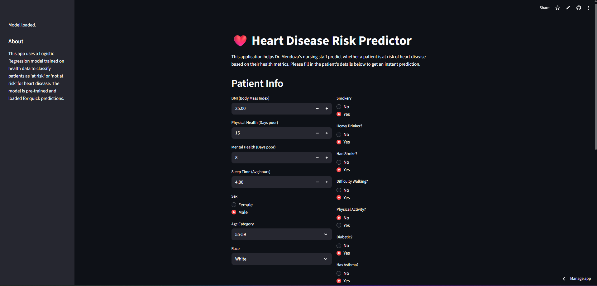
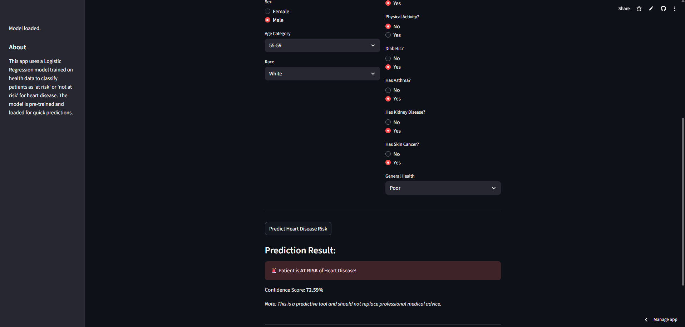

Heart Disease Risk Predictor
This project provides a simple web-based application to predict the risk of heart disease in patients, developed for a community health clinic. It uses a Logistic Regression model trained on patient health metrics.

Project Structure
train_model.py: Script to preprocess the dataset, train the machine learning model, and save the trained model.

streamlit_app.py: The Streamlit web application that loads the pre-trained model and provides a user interface for predictions.

heart_2020_uncleaned.csv: The raw dataset containing patient health metrics.

requirements.txt: Lists the Python libraries required to run the project.

logistic_regression_model.pkl: (Generated by train_model.py) The saved pre-trained Logistic Regression model.

training_columns.pkl: (Generated by train_model.py) A list of column names used during model training, ensuring consistent input for predictions.

Setup and Installation
Clone or Download the Project:
Get all the project files (including train_model.py, streamlit_app.py, and heart_2020_uncleaned.csv) into a local directory on your computer.

Install Python (if not already installed):
Ensure you have Python 3.8 or newer. You can download it from python.org.

Create a Virtual Environment (Recommended):
This helps manage project dependencies.

python -m venv venv

Activate the Virtual Environment:

Windows:

.\venv\Scripts\activate

macOS/Linux:

source venv/bin/activate

Install Required Libraries:
Create a requirements.txt file in your project directory with the following content:

streamlit
pandas
numpy
scikit-learn
joblib

Then, install them using pip:

pip install -r requirements.txt

How to Run the Application
Step 1: Train and Save the Model (Run this ONCE)
Before running the web application, you need to train the machine learning model and save it. This process can take a few minutes as it processes the full dataset.

Open your terminal or command prompt, navigate to your project directory, and run:

python train_model.py

This script will output messages indicating its progress and will create two files: logistic_regression_model.pkl and training_columns.pkl in your project directory.

Step 2: Run the Streamlit Web Application
Once the model files are generated, you can launch the web application.

In your terminal or command prompt (with your virtual environment still active), run:

streamlit run streamlit_app.py

This command will open a new tab in your default web browser displaying the "Heart Disease Risk Predictor" application.

Using the Application
Input Patient Information: Fill in the various health metrics and lifestyle details for a patient using the input fields.

Get Prediction: Click the "Predict Heart Disease Risk" button.

View Result: The application will display whether the patient is "AT RISK" or "NOT AT RISK" of heart disease, along with a confidence score.

Disclaimer: This tool is for preliminary screening only and should not replace professional medical advice. Always consult a licensed physician for diagnosis and treatment.

UI:

